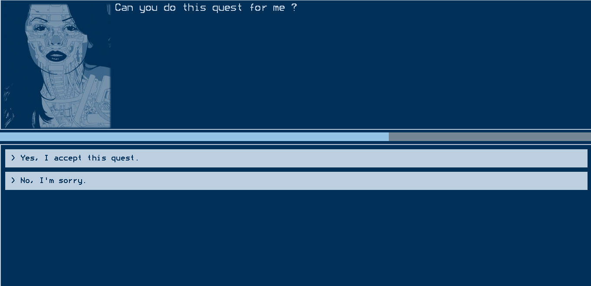
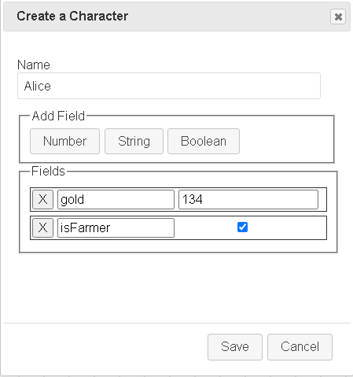
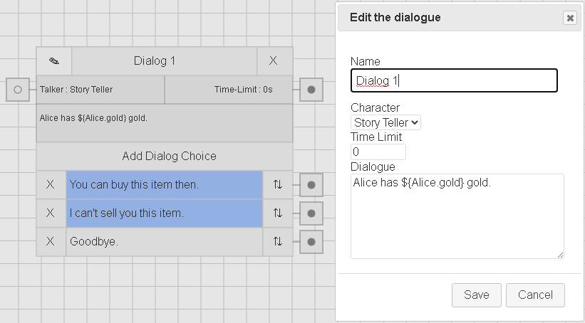
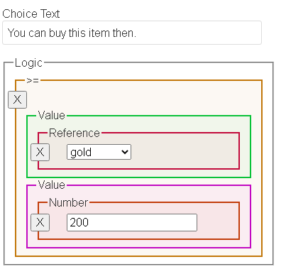
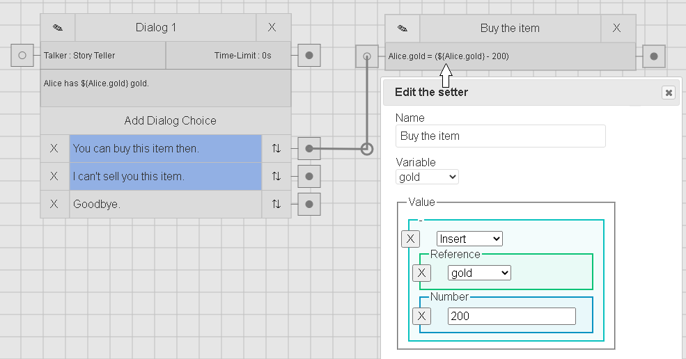
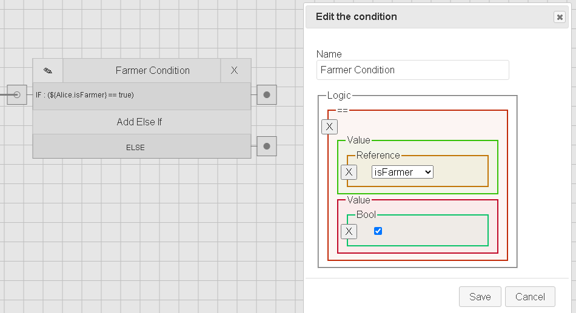

# Dialogger
  

Create dialogs with dialogger and make the choices "matter" with setters and conditions. You can check the live version [here.](https://dialogger.netlify.app/) Click on ``Example`` button for a fizzbuzz sample project.  

Dialogger has four key concepts such as **characters**, **dialogs**, **setters** and **conditions**.

### Characters
  
Characters are basically your data. You can reference this data in your **dialogs** to embed their values. ``Alice has ${Alice.gold} gold.`` You can also change their values with **setters** and do logic with **conditions**, this way you can make the choices actually matter. Also you can use time-limit to constrain the time of a dialog. Use the number 0 for the unlimited time.

### Dialogs
|||
|--|--|  

Dialogs are what you will be seeing in your game. You can add dialog choices and make them conditional as well. In the example above, if alice has 200 or more gold, we are showing the trading dialog choice.

### Setters
  
Setters are how you manipulate your character data. In the example above we have a setter that will decrease alice's gold by 200. We will reach this setter, only if the player clicks on the ``You can buy this item then.`` dialog choice. And remember from before, this dialog choice will only be visible if alice has 200 or more gold.

### Conditions
  
Conditions are how you do logic with the character data. Conditions has two mandatory outputs. First is for "true" path and the other is for "false". Additionally you can chain "else if" blocks together. In the example above we are checking if the alice is a farmer or not.  

For more detailed outlook, click on the ``Example`` button on the live [website](https://dialogger.netlify.app/) and explore for yourself.  
